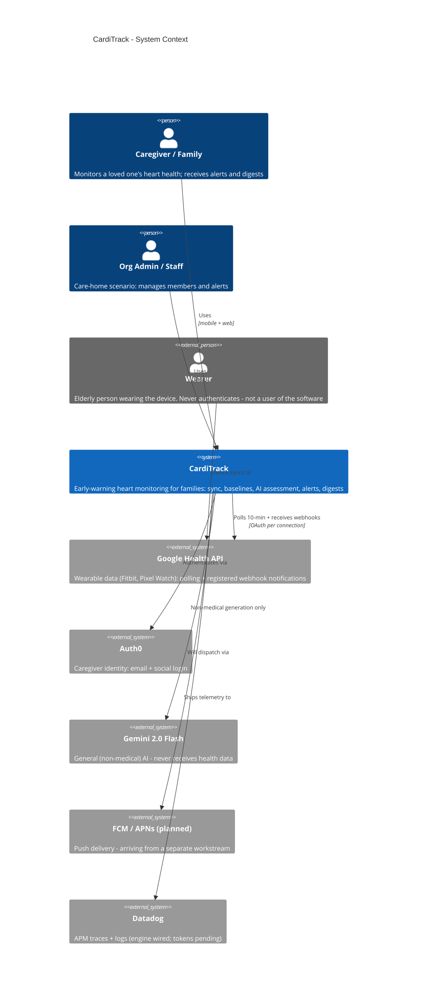
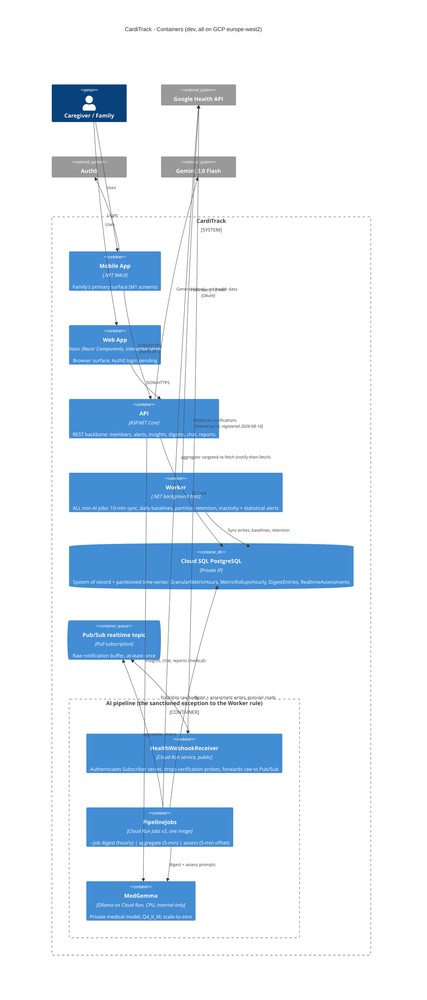
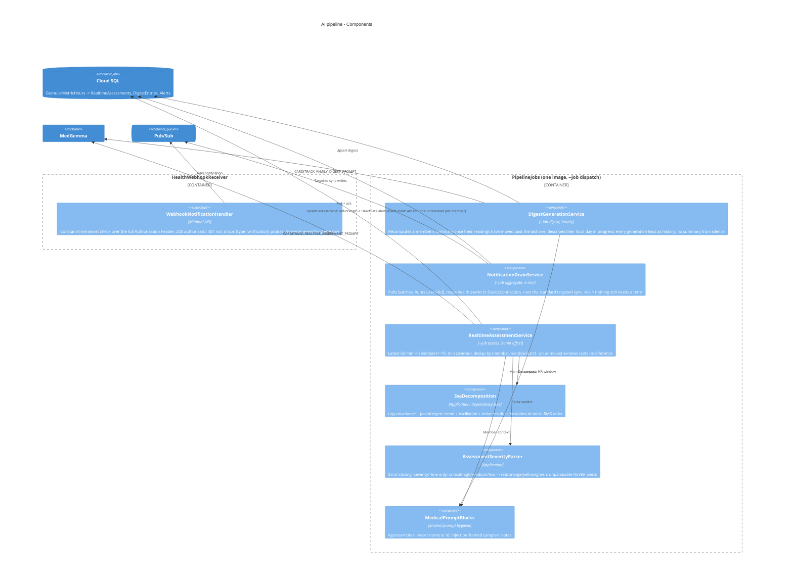
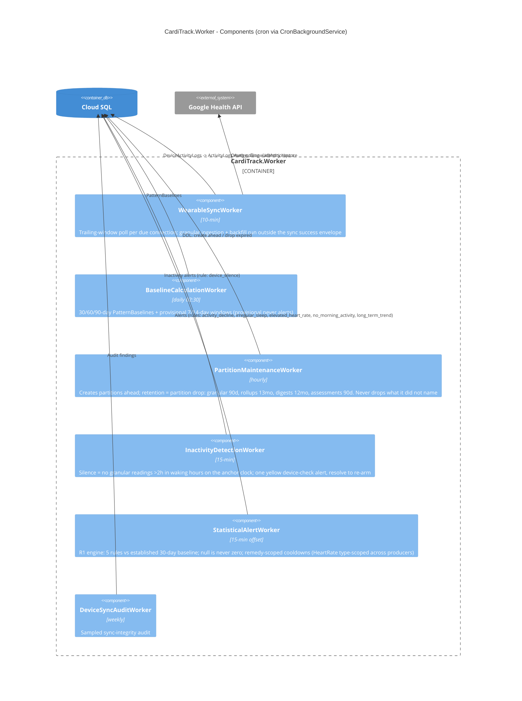

# CardiTrack — C4 Architecture

> The system as **built and deployed on 2026-08-10** — dev environment, GCP `carditrack-490120`,
> `europe-west2`. Planned-but-absent elements (push dispatch, trend interpretation, prod
> MedGemma) are marked *(planned)*; everything else on these diagrams exists and runs.
> Levels follow the [C4 model](https://c4model.com): Context → Containers → Components.
> For the manual operations behind this picture see the
> [production setup runbook](technical/production_setup_runbook.md); for the AI design,
> [llm_design.md](llm_design.md).

## Level 1 — System Context

The wearer never logs in (product decision 2026-08-10): they wear the device; the family
watches. Self-monitoring is not the product.



**The one boundary that explains most of the design:** health data goes only to the
**in-project MedGemma** (a container below, not an external system); Gemini is wired so that
hosts holding health data physically cannot reach it (`AddMedicalAiServices` registers no
public-provider key — DPIA A5).

## Level 2 — Containers



**Placement rule (CLAUDE.md, binding):** non-AI background jobs and DB polling live only in
the **Worker**; the AI pipeline (webhook aggregation, SSA, MedGemma calls, severity routing,
digests) lives only on **GCP Cloud Run + Pub/Sub** — and must not host non-AI jobs. That is
why inactivity detection (no AI call) is a Worker cron even though it serves the pipeline's
story, and why the digest job (an LLM process) is not a Worker cron even though it is scheduled
background work.

## Level 3 — Components: the AI pipeline



## Level 3 — Components: the Worker



## Code level (C4 L4) — the dependency rule

Not diagrammed per C4 practice; the compiler enforces it. Clean Architecture with four
composition roots (**Web, API, Worker, PipelineJobs** — every new repository registers in all
four):

```
Domain          -> references nothing
Application     -> Domain only, zero NuGet packages (SSA and the alert rules live here, dependency-free)
Infrastructure  -> Application + Domain (EF Core, Npgsql, provider clients, MedGemma/Gemini clients)
Hosts           -> composition roots only; HealthWebhookReceiver deliberately references
                   neither Application nor Infrastructure - no business logic in the one
                   container the internet can reach
```

## Keeping this current

This document states what exists, so it changes when reality does: update the affected level
in the same PR that lands the architectural change (new container, new external system, new
Worker/pipeline component, placement-rule exception), the same discipline as the
[manual-ops ledger](technical/production_setup_runbook.md).
