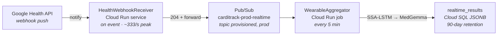

# Data Sync & Data Pull Architecture

**Allocation view** — which component runs on which node, over which technology, at which cadence.

Two different things are called "data pull" in CardiTrack, and they are unrelated:

| | **Ingestion pull** | **Read pull** |
|---|---|---|
| Direction | Google Health API → CardiTrack | CardiTrack API → client |
| Driver | `CardiTrack.Worker` cron + per-connection due-ness | User navigation / pull-to-refresh |
| Cadence | 30 min (worker *looks*), per-connection interval (what *syncs*) | 5-minute auto-refresh window, or on demand |

There is **no push ingestion today**. Webhook subscriptions are R2 — see [release_matrix.md](../release_matrix.md) and [llm_design.md](../llm_design.md).

---

## Allocation diagram

```mermaid
flowchart LR
  W["<b>Wearable</b><br/>Fitbit · Pixel Watch<br/><i>vendor firmware</i>"]

  subgraph GH["EXTERNAL · health.googleapis.com"]
    direction TB
    G1["Google Health API v4<br/><i>dataPoints:dailyRollUp ×6</i>"]
    G2["Google Health API v4<br/><i>dataPoints list ×2</i>"]
    G3["Google OAuth 2.0<br/><i>refresh_token grant</i>"]
  end

  subgraph WK["CLOUD RUN · carditrack-env-worker · .NET 10"]
    direction TB
    K0["CronBackgroundService<br/><i>Cronos 0.13.0 · 6-field UTC</i>"]
    K1["WearableSyncWorker<br/><i>0 */10 * * * *</i>"]
    K2["DeviceSyncAuditWorker<br/><i>0 0 4 * * 0 · 25 × 14 days</i>"]
    K3["BaselineCalculationWorker<br/><i>0 30 2 * * 0 · 30/60/90 d</i>"]
    K4["OrphanedOrganizationCleanupWorker<br/><i>0 0 3 * * * · MinAge 24 h</i>"]
    K5["OAuthTokenRefreshService<br/><i>5-min expiry buffer</i>"]
    K6["DeviceSyncService<br/><i>keyed DI on DeviceType</i>"]
    K7["FitbitApiClient"]
    K8["ActivityLogAggregationService"]
  end

  subgraph AP["CLOUD RUN · carditrack-env-api · ASP.NET Core"]
    direction TB
    A1["DevicesController<br/><i>POST .../devices/sync</i>"]
    A2["ManualDeviceSyncService<br/><i>1-min cooldown per member</i>"]
    A3["DashboardService<br/><i>reads ActivityLogs only</i>"]
  end

  subgraph DB["CLOUD SQL · POSTGRESQL 16"]
    direction TB
    D1["DeviceConnections<br/><i>AES-256-GCM tokens</i>"]
    D2["DeviceActivityLogs<br/><i>one row per device-day</i>"]
    D3["ActivityLogs<br/><i>one row per member-day</i>"]
    D4["PatternBaselines"]
    D5["DeviceTypeSyncProfiles"]
  end

  RD["<b>Memorystore Redis</b><br/>IDistributedCache<br/><i>cooldown 1 min · reports 1 h</i><br/><b>prod: not provisioned</b>"]
  MB["<b>MAUI mobile</b><br/>DashboardPage<br/><i>5-min auto-refresh</i><br/><i>2-h stale threshold</i>"]

  W -->|"vendor sync"| GH
  WK -->|"HTTPS · Bearer · 13 calls per day-in-window · every 10 min"| GH
  WK -->|"EF Core · Npgsql · upsert + merge"| DB
  DB -->|"GetDueForSyncAsync"| WK
  AP -->|"manual sync · on demand · max 1/min per member"| GH
  AP -->|"EF Core · Npgsql"| DB
  AP -->|"cooldown key · report cache"| RD
  MB -->|"HTTPS/JSON · 5-min window · pull-to-refresh"| AP
```



### R2 — designed, not built



The Worker polling path writes **only** to Cloud SQL and never publishes to Pub/Sub. The topic carries provider webhook notifications forwarded by `HealthWebhookReceiver`, not `ActivityLogs` egress from the Worker — the Worker stays free of AI-pipeline responsibilities (see [CLAUDE.md](../../CLAUDE.md)).

---

## Node → component → technology → cadence

| Deployment node | Components assigned | Technology | Cadence |
|---|---|---|---|
| **Cloud Run** `carditrack-<env>-worker` | `CronBackgroundService` | Cronos 0.13.0, 6-field cron with seconds, UTC; `BackgroundService` | continuous loop, `Task.Delay` to next occurrence |
| | `WearableSyncWorker` | keyed DI dispatch on `DeviceType` | `0 */10 * * * *` — every 10 min |
| | `DeviceSyncAuditWorker` | same, sample of 25 | `0 0 4 * * 0` — Sunday 04:00 |
| | `BaselineCalculationWorker` | `BaselineCalculator` (pure, stateless) | `0 30 2 * * 0` — Sunday 02:30 |
| | `OrphanedOrganizationCleanupWorker` | EF Core bulk delete | `0 0 3 * * *` — daily 03:00 |
| | `OAuthTokenRefreshService` | OAuth 2.0 `refresh_token` grant, `IHttpClientFactory` | inline in sync path, 5-min expiry buffer |
| | `DeviceSyncService`, `FitbitApiClient`, `ActivityLogAggregationService` | `HttpClient`, Newtonsoft parsing, EF Core | per due connection |
| **Cloud Run** `carditrack-<env>-api` | `DevicesController`, `ManualDeviceSyncService` | ASP.NET Core; shares `DeviceSyncService`/`FitbitApiClient` from `CardiTrack.Infrastructure` | on demand, 1-min cooldown per member |
| | `DashboardService`, `HealthInsightService`, `ReportGenerationService` | EF Core reads over `ActivityLogs` | per request |
| **Cloud SQL** PostgreSQL 16 | `DeviceConnections`, `DeviceActivityLogs`, `ActivityLogs`, `PatternBaselines`, `DeviceTypeSyncProfiles` | EF Core 10 + Npgsql, `EnableLegacyTimestampBehavior=false`; AES-256-GCM at rest for tokens | write per synced day; read per request |
| **Memorystore Redis** | manual-sync cooldown key, OAuth state, report cache | `IDistributedCache` | 1 min / 1 h TTLs — **`enable_redis = false` in prod today** |
| **External** `health.googleapis.com` | Google Health API v4, Google OAuth 2.0 | HTTPS, Bearer tokens | 13 calls per day-in-window per connection |
| **Client** MAUI mobile | `DashboardPage` | .NET MAUI (iOS/Android) | 5-min auto-refresh window; 2-h stale threshold |
| **Client** Blazor web | — | .NET 10 Blazor Web App, EF Core direct to Cloud SQL | no data-refresh path yet (template shell) |

---

## What one scheduled sync does

`WearableSyncWorker` → `DeviceSyncService.SyncCardiMemberAsync` → `PullWindowAsync`:

1. **Refresh the token if needed** — `RefreshIfExpiredAsync`, 5-minute expiry buffer. Google access tokens live ~1 h (`TokenLifetimeHours: 1`). Token refresh is *not* a standalone cron job.
2. **Fetch today**, plus — on the **first pull of each UTC day only** — a trailing window reaching back `SyncLookbackDays` = **3** complete days, iterated **oldest first** so a mid-window failure still leaves the earlier days stored. The trailing days catch a provider revising a *finished* day; re-reading them every 10 minutes would spend the per-wearer quota on numbers that cannot have moved. Whether the repair pass is due is read off `LastSyncDate`'s UTC date, so a connection that missed a day takes the full window on its next pull. Today's numbers are necessarily partial, so the readers that assume a whole day exclude it — `BaselineCalculationWorker` windows to the last complete day, and `DashboardService` suppresses the compare-against-baseline reading for cumulative metrics on a day still in progress.
3. **Per day, 13 HTTP calls**, issued concurrently in four groups (activity ∥ heart rate ∥ sleep ∥ additional):
   - **7 roll-ups** — `POST /v4/users/me/dataTypes/{steps|distance|active-minutes|total-calories|floors|sedentary-period|heart-rate}/dataPoints:dailyRollUp`
   - `GET /v4/users/me/dataTypes/daily-resting-heart-rate/dataPoints` (a Daily record — no rollup method)
   - `GET /v4/users/me/dataTypes/sleep/dataPoints?filter=sleep.interval.civil_end_time >= …` (civil time, so it buckets by the wearer's local day like the rollups do)
   - **4 additional** — `oxygen-saturation` as a sample series, then `daily-vo2-max`, `daily-respiratory-rate` and `daily-sleep-temperature-derivations` as Daily records
   
   Peak in-flight is therefore ~12 requests for a single wearer. The Google Health per-user ceiling is 300 requests/minute, which this is comfortably inside on volume, but its QPS reading (5/s standard, 2.5/s for an unverified app) is **not** — see the quota note below.
4. **Write raw** → `SaveChanges` → **re-merge** → `SaveChanges`. The raw row is saved first because the merge reads every device's *stored* row for that day.
5. **Stamp `LastSyncDate` only once the whole window lands** — a partial sync stays due for retry instead of silently leaving a hole.

### Two-level frequency

The cron sets how often the worker **looks**. Whether a connection is actually pulled is decided per row:

```csharp
// DeviceConnectionRepository.GetDueForSyncAsync()
dc.LastSyncDate == null || dc.LastSyncDate.Value.AddMinutes(dc.SyncFrequencyMinutes) <= now
```

`SyncFrequencyMinutes` defaults to **10**, so cron and due-ness coincide today — but they are independent knobs. `NextPullAt` and `ConsecutiveEmptyPulls` exist in the schema for cadence calibration; nothing writes them yet, and dormancy backoff is off (`dormancy_threshold_pulls = 0` in both environments).

The same query excludes removed and monitoring-paused members — in the query rather than the worker, so every caller inherits it. Pausing monitoring has to stop *collection*, not just *display*.

### Two-tier storage

| Table | Grain | Written by |
|---|---|---|
| `DeviceActivityLogs` | one row per **device** per day, unique `(DeviceConnectionId, Date)` | `DeviceSyncService`, raw from provider |
| `ActivityLogs` | one row per **CardiMember** per day, unique `(CardiMemberId, Date)` | `ActivityLogAggregationService.RecomputeAsync` |

`ActivityLogMerge` coalesces **each metric independently** by device priority (`IsPrimary` desc → `ConnectedDate` asc → `Id`) and **never sums** — a watch and a ring worn by the same person both count the same steps. It rebuilds from the full raw set every time, so it is idempotent and order-independent. Every reader consumes `ActivityLogs` only.

> Providers must report a missing metric as `null`, never `0` — the merge coalesces on the first non-null value, so a placeholder `0` from a higher-priority device would beat another device's genuine reading.

`DeviceActivityLogs.UpdatedDate` deliberately does **not** move on an unchanged upsert, so it measures *when the provider's numbers changed*, not when we polled. That is what makes settle latency, revision tail and poll yield measurable at all — and it means a routine sync over a settled window issues no `UPDATE`.

---

## The other two ingestion paths

**Manual sync** — `POST /api/cardimembers/{id}/devices/sync` → `ManualDeviceSyncService`. Requires **view** access (not manage), refused when monitoring is paused, rate-limited by a **1-minute per-member cooldown** in `IDistributedCache`. Provider quota is per-app, not per-user, so one caregiver hammering refresh would spend everyone's budget. It runs the identical `SyncCardiMemberAsync` path.

**Audit pull** — `DeviceSyncAuditWorker`, weekly. Re-fetches a **random sample of 25** connections over **14 days** (`AuditLookbackDays` — the widest range the Google Health API accepts for HR/AZM/calorie rollups). Goes through `AuditSyncAsync`, which shares the pull-and-merge core but **stamps nothing**: no `LastSyncDate` (that would push the connection's next routine pull out by a full interval) and no `SyncError`. A 3-day routine window structurally *cannot observe* a provider amending day 5, so any picture of "how far back data changes" built from routine syncs alone would be an artefact of our own schedule. It still stores what it finds, so late provider corrections are repaired as a side effect of measuring them. Output lands in the `DeviceTypeSyncProfiles` table — one `DeviceTypeSyncProfile` row per `DeviceType`.

---

## Cadence reference

| Setting | Value | Where |
|---|---|---|
| `WearableSyncWorker` cron | `0 */10 * * * *` | `Workers:WearableSyncWorker:CronExpression` |
| `OrphanedOrganizationCleanupWorker` cron | `0 0 3 * * *` | `Workers:…:CronExpression` |
| `BaselineCalculationWorker` cron | `0 30 2 * * 0` | `Workers:…:CronExpression` |
| `DeviceSyncAuditWorker` cron / sample | `0 0 4 * * 0` / 25 | `Workers:DeviceSyncAuditWorker` |
| `SyncFrequencyMinutes` | 10 | per `DeviceConnection` row |
| `sync_lookback_days` | 3 | `device_pull_params` tfvars |
| `audit_lookback_days` | 14 | `device_pull_params` tfvars |
| `min_pull_interval_minutes` | 10 | `device_pull_params` tfvars |
| `max_pull_interval_minutes` | 1440 | `device_pull_params` tfvars |
| `dormancy_threshold_pulls` | 0 (**backoff disabled**) | `device_pull_params` tfvars |
| OAuth expiry buffer | 5 min | `OAuthTokenRefreshService.ExpiryBuffer` |
| Manual-sync cooldown | 1 min | `ManualDeviceSyncService.Cooldown` |
| Report download TTL | 1 h | `ReportGenerationService.ReportTtl` |
| Mobile auto-refresh window | 5 min | `DashboardPage.AutoRefreshInterval` |
| Mobile stale threshold | 2 h | `DashboardPage.StaleThreshold` |
| Auth token refresh skew | 30 s | `TokenRefresher.ExpirySkew` |
| Orphan cleanup `MinAge` | 24 h | `OrphanedOrganizationCleanupWorker.MinAge` |

### Google Health API quota

Published default limits, and what this pipeline actually spends against them:

| Limit | Default | What we spend |
|---|---|---|
| Per project, daily | 86.4M requests/day (~1,000 QPS sustained) | ~1,900 requests/connection/day at a 10-minute cadence — ~19M/day at the 10,000-wearer design target, **22%** |
| Per project, minutely | 120,000 requests/min (~2,000 QPS burst) | `WearableSyncWorker` walks due connections **sequentially**, so a worker instance holds ~12 in flight |
| **Per user, minutely** | **300 requests/min** (5 QPS standard; **2.5 QPS and 100 users max while unverified**) | 13 on a routine pull, 52 on the day's first pull — comfortable on volume |

Two things to keep in view, neither of which is about how often we poll:

- **The per-user QPS burst is over.** A day's snapshot fires ~12 requests at once for one wearer, against a 5/s standard reading and 2.5/s unverified. Volume is fine; shape is not. Capping the per-wearer fan-out is the fix, not a slower cadence.
- **Nothing enforces any of this at runtime.** `MinPullIntervalMinutes`, `MaxPullIntervalMinutes`, `DormancyThresholdPulls` and `DormancyBackoffFactor` are validated in `DeviceProviderServiceExtensions.PostConfigure` — so a malformed pair stops the host — but **no code consults them once running**: there is no governor and no dormancy backoff. `MaxRequestsPerSecond` is not read at all, not even validated. `FitbitApiClient` has no `429` handling either: a throttle surfaces as `FitbitApiException`, marks the connection `SyncError` and aborts that pull.
- **The 100-user unverified cap** binds before any of the above. Restricted-scope verification + CASA is issue #39.

Cadence belongs to the **device type**, not to any one connection — providers differ in how quickly they finalise a day and how hard they rate-limit. The `[min, max]` bounds live in version-controlled infrastructure, so widening them is deliberately a deploy: a miscomputed cadence in a cardiac-monitoring product does not cost throughput, it silently delays alerts. Both `AddFitbitProvider`'s `PostConfigure` and the Terraform variable validate the same rules, so the plan fails before a bad revision deploys *and* the host fails fast if one is set some other way.

---

## Failure semantics

| Failure | Effect |
|---|---|
| Provider API exception mid-sync | `ConnectionStatus.SyncError`, but **still in the sync rotation** — retry rides its own `SyncFrequencyMinutes` |
| Refresh token rejected (`invalid_grant`, `invalid_token`, `expired_token`, `access_denied`) | `TokenExpired` — out of rotation until re-consent |
| Network/DNS failure during refresh | Status untouched — a DNS blip must not retire a working device |
| `400`/`404` on `daily-resting-heart-rate` | Tolerated, `RestingHeartRate` stays null — unless it is a malformed-request `400`, which propagates |
| Audit pull failure | Logged at **Warning**; no data and no status affected |
| Connection torn down mid-pull | `MarkSyncSucceededAsync` no-ops — never hands back a device the user just removed |

> **Prod log level is `Warning`,** so a healthy run leaves no trace at all: the per-run `Information` lines are suppressed, and cron is internal to the service so there is no request log to fall back on. To answer "did the job run?", set `log_minimum_level = { worker = "Information" }` in the environment's tfvars.

---

## Related documentation

- [apps/worker/readme.md](../apps/worker/readme.md) — worker internals, configuration, deployment
- [llm_design.md](../llm_design.md) — the R2 webhook + Pub/Sub pipeline
- [release_matrix.md](../release_matrix.md) — polling vs webhooks sequencing
- [infrastructure.md](../infrastructure.md) — Cloud Run, Cloud SQL, Terraform

---

**Last Updated:** August 8, 2026
