# Data Sync & Data Pull Architecture

**Allocation view** — which component runs on which node, over which technology, at which cadence.

Two different things are called "data pull" in CardiTrack, and they are unrelated:

| | **Ingestion pull** | **Read pull** |
|---|---|---|
| Direction | Google Health API → CardiTrack | CardiTrack API → client |
| Driver | `CardiTrack.Worker` cron + per-connection due-ness | User navigation / pull-to-refresh |
| Cadence | 10 min (worker *looks*), per-connection interval (what *syncs*, default 10 min) | refresh on every app-foreground transition (5-second minimum gap), or pull-to-refresh |

Push ingestion is **live in dev** (Subscriber re-registered against `https://webhook.dev.carditrack.com/webhooks/google-health` after the 2026-08-13 WAF cutover — the receiver now sits behind the load balancer with ingress `INTERNAL_LOAD_BALANCER`): Google Health webhook notifications trigger targeted syncs within seconds, with the 10-minute poll as the loss-proof fallback — see [release_matrix.md](../release_matrix.md) and [llm_design.md](../llm_design.md).

---

## Allocation diagram

```mermaid
flowchart LR
  W["<b>Wearable</b><br/>Fitbit · Pixel Watch<br/><i>vendor firmware</i>"]

  subgraph GH["EXTERNAL · health.googleapis.com"]
    direction TB
    G1["Google Health API v4<br/><i>dataPoints:dailyRollUp ×6</i>"]
    G2["Google Health API v4<br/><i>dataPoints list ×2</i>"]
    G3["Google OAuth 2.0<br/><i>refresh_token grant</i>"]
  end

  subgraph WK["CLOUD RUN · carditrack-env-worker · .NET 10"]
    direction TB
    K0["CronBackgroundService<br/><i>Cronos 0.13.0 · 6-field UTC</i>"]
    K1["WearableSyncWorker<br/><i>0 */10 * * * *</i>"]
    K2["DeviceSyncAuditWorker<br/><i>0 0 4 * * 0 · 25 × 14 days</i>"]
    K3["BaselineCalculationWorker<br/><i>0 30 2 * * * · 7/14/30/60/90 d</i>"]
    K4["OrphanedOrganizationCleanupWorker<br/><i>0 0 3 * * * · MinAge 24 h</i>"]
    K5["OAuthTokenRefreshService<br/><i>5-min expiry buffer</i>"]
    K6["DeviceSyncService<br/><i>keyed DI on DeviceType</i>"]
    K7["GoogleHealthApiClient"]
    K8["ActivityLogAggregationService"]
  end

  subgraph AP["CLOUD RUN · carditrack-env-api · ASP.NET Core"]
    direction TB
    A1["DevicesController<br/><i>POST .../devices/sync</i>"]
    A2["ManualDeviceSyncService<br/><i>1-min cooldown per member</i>"]
    A3["DashboardService<br/><i>reads ActivityLogs only</i>"]
  end

  subgraph DB["CLOUD SQL · POSTGRESQL 16 (local/tests: 17)"]
    direction TB
    D1["DeviceConnections<br/><i>AES-256-GCM tokens</i>"]
    D2["DeviceActivityLogs<br/><i>one row per device-day</i>"]
    D3["ActivityLogs<br/><i>one row per member-day</i>"]
    D4["PatternBaselines"]
    D5["DeviceTypeSyncProfiles"]
  end

  RD["<b>Memorystore Redis</b><br/>IDistributedCache<br/><i>cooldown 1 min · reports 1 h</i><br/><b>prod: not provisioned</b>"]
  MB["<b>MAUI mobile</b><br/>DashboardPage<br/><i>refresh on foreground resume</i><br/><i>2-h stale threshold</i>"]

  W -->|"vendor sync"| GH
  WK -->|"HTTPS · Bearer · up to 26 calls per day-in-window (up to 21 daily + 5 granular) + 1 battery per pull · every 10 min"| GH
  WK -->|"EF Core · Npgsql · upsert + merge"| DB
  DB -->|"GetDueForSyncAsync"| WK
  AP -->|"manual sync · on demand · max 1/min per member"| GH
  AP -->|"EF Core · Npgsql"| DB
  AP -->|"cooldown key · report cache"| RD
  MB -->|"HTTPS/JSON · resume refresh · pull-to-refresh"| AP
```



### R2 — receiver, aggregation and assessment live (dev)

```mermaid
flowchart LR
  P0["Google Health API<br/><i>webhook push</i>"]
  P1["HealthWebhookReceiver<br/>Cloud Run service<br/><i>on event · ~333/s peak</i>"]
  P2["Pub/Sub<br/>carditrack-prod-realtime<br/><i>topic provisioned, prod</i>"]
  P3["WearableAggregator<br/>Cloud Run job<br/><i>every 5 min</i>"]
  P5["GranularMetricHours<br/><i>minute-grain store</i>"]
  P6["RealtimeAssessor<br/>Cloud Run job<br/><i>every 5 min · :02 offset · SSA-gated</i>"]
  P4["RealtimeAssessments<br/><i>Cloud SQL, typed + partitioned</i><br/><i>90-day retention</i>"]

  P0 -->|"notify"| P1 -->|"204 + forward"| P2 --> P3 -->|"targeted sync"| P5
  P5 --> P6 -->|"SSA → MedGemma → severity"| P4
```



The Worker polling path writes **only** to Cloud SQL and never publishes to Pub/Sub. The topic carries provider webhook notifications forwarded by `HealthWebhookReceiver`, not `ActivityLogs` egress from the Worker — the Worker stays free of AI-pipeline responsibilities (see [CLAUDE.md](../../CLAUDE.md)).

The aggregator's **first increment is live (dev)**: every 5 minutes the `pipeline-jobs-aggregator` Cloud Run job drains the subscription, maps each notification's `healthUserId` to its `DeviceConnection`, and runs the standard `SyncCardiMemberAsync` at worker-cadence scope — the same pull, triggered by the provider instead of the clock. Acknowledgment means "nothing here still needs a retry": unknown users and unparseable payloads ACK (the poll guarantees nothing is lost), a failed sync leaves its messages for redelivery. SSA/MedGemma consumption is live too: the `pipeline-jobs-assessor` job (every 5 minutes at :02 offset from the aggregator) reads each member's latest hour from the granular store, decomposes it with SSA, and asks MedGemma for a severity verdict **only when the score is a jump** (≥3 typical jitters) — ordinary windows are not stored. Red/orange verdicts become `HeartRate` alerts and POST to the API's internal enqueue endpoint. The assessor reads **only the granular store**, so it works identically whether the minutes arrived by webhook-triggered sync or by the routine poll.

---

## Node → component → technology → cadence

| Deployment node | Components assigned | Technology | Cadence |
|---|---|---|---|
| **Cloud Run** `carditrack-<env>-worker` | `CronBackgroundService` | Cronos 0.13.0, 6-field cron with seconds, UTC; `BackgroundService` | continuous loop, `Task.Delay` to next occurrence |
| | `WearableSyncWorker` | keyed DI dispatch on `DeviceType` | `0 */10 * * * *` — every 10 min |
| | `DeviceSyncAuditWorker` | same, sample of 25 | `0 0 4 * * 0` — Sunday 04:00 |
| | `BaselineCalculationWorker` | `BaselineCalculator` (pure, stateless) | `0 30 2 * * *` — daily 02:30 |
| | `OrphanedOrganizationCleanupWorker` | EF Core bulk delete | `0 0 3 * * *` — daily 03:00 |
| | `PartitionMaintenanceWorker` | partition DDL over the sub-daily/pipeline tables | `0 15 * * * *` — hourly at :15, plus `RunOnStartup` |
| | `InactivityDetectionWorker` | device-silence `Inactivity` alerts | `0 */15 * * * *` — every 15 min |
| | `DeviceAuthRecoveryWorker` | retries `TokenExpired`/`AuthError` grants, per-connection backoff | `0 3-59/15 * * * *` — every 15 min, :03 offset |
| | `DataCompletenessWorker` | data-gap detection → notifications | `0 0 6 * * *` — daily 06:00 |
| | `QuietReassuranceWorker` | all-clear pushes for members with no alert in 7+ days | `0 30 8 * * *` — daily 08:30 |
| | `NotificationDispatchWorker` | push delivery + escalation ladder | `*/30 * * * * *` — every 30 s |
| | `PushCanaryWorker` | end-to-end push delivery canary | `0 */15 * * * *` — every 15 min |
| | `OAuthTokenRefreshService` | OAuth 2.0 `refresh_token` grant, `IHttpClientFactory` | inline in sync path, 5-min expiry buffer |
| | `DeviceSyncService`, `GoogleHealthApiClient`, `ActivityLogAggregationService` | `HttpClient`, Newtonsoft parsing, EF Core | per due connection |
| **Cloud Run** `carditrack-<env>-api` | `DevicesController`, `ManualDeviceSyncService` | ASP.NET Core; shares `DeviceSyncService`/`GoogleHealthApiClient` from `CardiTrack.Infrastructure` | on demand, 1-min cooldown per member |
| | `DashboardService`, `HealthInsightService`, `ReportGenerationService` | EF Core reads over `ActivityLogs` | per request |
| **Cloud SQL** PostgreSQL 16 | `DeviceConnections`, `DeviceActivityLogs`, `ActivityLogs`, `PatternBaselines`, `DeviceTypeSyncProfiles` | EF Core 10 + Npgsql, `EnableLegacyTimestampBehavior=false`; AES-256-GCM at rest for tokens | write per synced day; read per request |
| **Memorystore Redis** | manual-sync cooldown key, OAuth state, report cache | `IDistributedCache` | 1 min / 1 h TTLs — **`enable_redis = false` in prod today** |
| **External** `health.googleapis.com` | Google Health API v4, Google OAuth 2.0 | HTTPS, Bearer tokens | up to **26** calls per day-in-window per connection on the Worker cadence (up to 21 daily + 5 granular), **plus one `pairedDevices` battery read per pull** — flat, not per day, and skipped entirely without the `settings` scope |
| **Client** MAUI mobile | `DashboardPage` | .NET MAUI (iOS/Android) | refresh on foreground resume (5-s minimum gap) + pull-to-refresh; 2-h stale threshold |
| **Client** Blazor web | — | .NET 10 Blazor Web App, EF Core direct to Cloud SQL | no data-refresh path yet (template shell) |

---

## What one scheduled sync does

`WearableSyncWorker` → `DeviceSyncService.SyncCardiMemberAsync` → `PullWindowAsync`:

1. **Refresh the token if needed** — `RefreshIfExpiredAsync`, 5-minute expiry buffer. Google access tokens live ~1 h (`TokenLifetimeHours: 1`). Token refresh is *not* a standalone cron job.
2. **Fetch today**, plus — on the **first pull of each UTC day only** — a trailing window reaching back `SyncLookbackDays` = **3** complete days, iterated **oldest first** so a mid-window failure still leaves the earlier days stored. The trailing days catch a provider revising a *finished* day; re-reading them every 10 minutes would spend the per-wearer quota on numbers that cannot have moved. Whether the repair pass is due is read off `LastSyncDate`'s UTC date, so a connection that missed a day takes the full window on its next pull. Today's numbers are necessarily partial, so the readers that assume a whole day exclude it — `BaselineCalculationWorker` windows to the last complete day, and `DashboardService` suppresses the compare-against-baseline reading for cumulative metrics on a day still in progress.
3. **Per day, 17 HTTP calls, up to 21**, in five groups (activity ∥ heart rate ∥ sleep ∥ additional, then exertion once sleep returns):
   - **7 roll-ups** — `POST /v4/users/me/dataTypes/{steps|distance|active-minutes|total-calories|floors|sedentary-period|heart-rate}/dataPoints:dailyRollUp`
   - `GET /v4/users/me/dataTypes/daily-resting-heart-rate/dataPoints` (a Daily record — no rollup method)
   - `GET /v4/users/me/dataTypes/sleep/dataPoints?filter=sleep.interval.civil_end_time >= …` (civil time, so it buckets by the wearer's local day like the rollups do). **The night is every session that ended that day and started before noon by the wearer's clock, added together** (`GoogleHealthApiClient.NightSessions`). A night the provider splits at a long waking counts whole; a session that started after noon is a nap and never the night, so a nap-only day has no night at all. A session with no civil start (historical data) falls back to the single longest session. **+1** on a day a night (a session of four hours or more) ended: the *next* day's list too, for the night that starts that evening, so its bedtime clips the sedentary stretch below.
   - **6 additional** — `oxygen-saturation` and `respiratory-rate-sleep-summary` as sample series, then `daily-vo2-max`, `daily-respiratory-rate`, `daily-sleep-temperature-derivations` and `daily-heart-rate-variability` as Daily records. **+1** when the `oxygen-saturation` series comes back empty: the `daily-oxygen-saturation` record, read for its average instead.
   - **2 exertion** — `time-in-heart-rate-zone` as a rollup and `daily-heart-rate-zones` as a Daily record (the wearer's own zone thresholds). **+1** on a day a night ended: `activity-level` as an interval list, read for the longest unbroken sedentary stretch rather than for its total — skipped, and the stretch left null, on any other day, since the small hours would otherwise be the longest still stretch on almost every day. **+1** more once that list leaves any sedentary time outside sleep: a `heart-rate` `dataPoints:rollUp` over 5-minute windows spanning it, the worn check that keeps a watch on its charger from reading as a still afternoon. It follows the `activity-level` list inside the same read, so it adds no concurrency

   A sample or interval series that runs past one page adds a request per page on top.

   Up to 16 are in flight at once for a single wearer: 14 go out together — every group but exertion, with heart rate's two reads and SpO2's fallback each waiting on the one before — and exertion's reads join them once the sleep lists return. The Google Health per-user ceiling is 300 requests/minute, which this is comfortably inside on volume, but its QPS reading (5/s standard, 2.5/s for an unverified app) is **not** — see the quota note below.

4. **Write raw** → `SaveChanges` → **re-merge** → `SaveChanges`. The raw row is saved first because the merge reads every device's *stored* row for that day.
5. **Stamp `LastSyncDate` only once the whole window lands** — a partial sync stays due for retry instead of silently leaving a hole.
6. **Fetch the granular series for the window's days** (Worker pulls only — `SyncScope.WorkerCadence`, and only *after* the success stamp: granular is enrichment, and a transient failure in it must not un-succeed the daily data that already landed). 5 more `list` calls per day (heart rate, SpO2 and heart-rate variability as timestamped samples, steps and active-zone-minutes as intervals) — issued **sequentially, not concurrently**, a deliberate choice to bound paging buffers after the 2026-08-11 worker OOM — bucketed into per-device hour vectors (`GranularDayBucketer` — additive metrics sum within a minute, level metrics take the latest reading) and stored via `GranularIngestionService`, which then recomputes the member's hourly rollups from the **merged** window. Backfill days skip this — intraday history depth is unverified (granular ADR open question). Worker-cadence day cost is therefore up to **26 calls**, still one day-at-a-time against the per-wearer ceiling.
7. **Classify last night and the night before** (Worker pulls only, after the granular pass, best-effort). `ActivityLogAggregationService.ClassifyNightAsync` sets `ActivityLog.NightStatus` (decision 2026-09-25):
   - **Slept:** a sleep session arrived.
   - **Awake:** no session, but minute-level heart rate covers at least 75% of the night window, and heart rate has arrived from after the usual waking time. Written as `SleepMinutes = 0`, so every average, baseline and alert counts it as a night of no sleep.
   - **Pending:** worn, but nothing has synced since waking, or the night isn't over yet.
   - **NoData:** no sign the watch was worn.

   The night window runs from the member's typical bedtime to typical waking time from the baseline, or 22:00 to 07:00 on their clock until those are learned (`NightSleepClassifier`). The re-merge in step 4 keeps a stored status across a rebuild, so an awake night never flickers back to a gap; a session arriving late turns it into a slept night. The raw per-device rows are never touched.
8. **Backfill one chunk of history** (Worker pulls only — `SyncScope.WorkerCadence`; the manual path skips this so a caregiver's refresh never waits on last month). `DeviceConnection.HistoryBackfilledTo` walks backwards from the routine window towards `backfill_days` (**90**) days ago, `backfill_chunk_days` (**7**) days per pull, newest first, advancing per day so an interrupted chunk resumes. A fresh connection's history is fully fetched after ~13 pulls (~2 h at the 10-minute cadence), which is what lets the 30-day baseline exist on day one for a wearable that has been worn before. Empty days are checked but not stored — an all-null row would read as a "data day" to the baseline coverage gate.

### Two-level frequency

The cron sets how often the worker **looks**. Whether a connection is actually pulled is decided per row:

```csharp
// DeviceConnectionRepository.GetDueForSyncAsync()
dc.LastSyncDate == null || dc.LastSyncDate.Value.AddMinutes(dc.SyncFrequencyMinutes) <= now
```

`SyncFrequencyMinutes` defaults to **10**, so cron and due-ness coincide today — but they are independent knobs. `NextPullAt` and `ConsecutiveEmptyPulls` exist in the schema for cadence calibration; nothing writes them yet, and dormancy backoff is off (`dormancy_threshold_pulls = 0` in both environments).

The same query excludes removed and monitoring-paused members — in the query rather than the worker, so every caller inherits it. Pausing monitoring has to stop *collection*, not just *display*.

### Two-tier storage, at two grains

| Table | Grain | Written by |
|---|---|---|
| `DeviceActivityLogs` | one row per **device** per day, unique `(DeviceConnectionId, Date)` | `DeviceSyncService`, raw from provider |
| `ActivityLogs` | one row per **CardiMember** per day, unique `(CardiMemberId, Date)` | `ActivityLogAggregationService.RecomputeAsync` |
| `GranularMetricHours` | one row per **device** × metric × hour (60-slot minute vector), day-partitioned | `GranularIngestionService`, worker cadence only |
| `MetricRollupsHourly` | one row per **CardiMember** × metric × hour, month-partitioned | `GranularIngestionService`, recomputed from the merged window |
| `ActivityLogsWeekly` / `ActivityLogsMonthly` | views over `ActivityLogs` | derived, no writer — the week/month horizons of the rollup ladder |
| `RhythmEpisodes` | one row per **irregular-rhythm analysis window**, day-partitioned on the window start | `DeviceSyncService`, only for a connection granting the rhythm scopes |

**Rhythm reads sit outside the snapshot.** `electrocardiogram` and `irregular-rhythm-notification` are the only data types behind their own OAuth scopes (`googlehealth.ecg.readonly`, `googlehealth.irn.readonly`), so `DeviceSyncService` checks the connection's stored scope list before spending a request — the same gate `CaptureBatteryAsync` applies to the settings scope. Folding them into `GetHealthSnapshotAsync` would make every wearer pay two guaranteed 403s per pull to learn something the stored scope list already knows. The client tolerates a 403 anyway, as a backstop for the window where that stored list and the token's real grant disagree.

The day's **counts** (`EcgReadings`, `EcgAtrialFibrillationReadings`, `IrregularRhythmNotifications`) land on the day row and merge like any other optional reading — coalesced by device priority, never summed, since two watches on one wearer would each report the same notification and adding them would tell a family their relative had two episodes when they had one. The **beats** behind those notifications go to `RhythmEpisodes` per device rather than merged: a window is a measurement one watch made, and two watches disagreeing about the same minutes is information rather than a conflict to resolve.

Neither the history re-pull nor the autonomous backfill reads rhythm, though the re-pull is otherwise "everything the provider has for these days". The ECG filter admits no upper bound, so reaching a day weeks back means paging forward through every reading taken since. Those days keep null counts, which reads as "cannot see" rather than "nothing happened" — the honest answer for a day nobody looked at.

`ActivityLogMerge` coalesces **each metric independently** by device priority (`IsPrimary` desc → `ConnectedDate` asc → `Id`) and **never sums** — a watch and a ring worn by the same person both count the same steps. It rebuilds from the full raw set every time, so it is idempotent and order-independent. Every reader consumes `ActivityLogs` only. The granular tier repeats the same raw-then-derived shape at hour grain: per-device vectors merged on read (`GranularSeriesMerge`, same priority rule), member rollups recomputed from the merged result.

> Providers must report a missing metric as `null`, never `0` — the merge coalesces on the first non-null value, so a placeholder `0` from a higher-priority device would beat another device's genuine reading.

`DeviceActivityLogs.UpdatedDate` deliberately does **not** move on an unchanged upsert, so it measures *when the provider's numbers changed*, not when we polled. That is what makes settle latency, revision tail and poll yield measurable at all — and it means a routine sync over a settled window issues no `UPDATE`.

---

## The other three ingestion paths

**Manual sync** — `POST /api/cardimembers/{id}/devices/sync` → `ManualDeviceSyncService`. Requires **view** access (not manage), refused when monitoring is paused, rate-limited by a **1-minute per-member cooldown** in `IDistributedCache`. Provider quota is per-app, not per-user, so one caregiver hammering refresh would spend everyone's budget. It runs the identical `SyncCardiMemberAsync` path.

**Audit pull** — `DeviceSyncAuditWorker`, weekly. Re-fetches a **random sample of 25** connections over **14 days** (`AuditLookbackDays` — the widest range the Google Health API accepts for HR/AZM/calorie rollups). Goes through `AuditSyncAsync`, which shares the pull-and-merge core but **stamps nothing**: no `LastSyncDate` (that would push the connection's next routine pull out by a full interval) and no `SyncError`. A 3-day routine window structurally *cannot observe* a provider amending day 5, so any picture of "how far back data changes" built from routine syncs alone would be an artefact of our own schedule. It still stores what it finds, so late provider corrections are repaired as a side effect of measuring them. Output lands in the `DeviceTypeSyncProfiles` table — one `DeviceTypeSyncProfile` row per `DeviceType`.

**Caregiver history re-pull** — `POST /api/v1/cardimembers/{id}/devices/{deviceId}/history-repull` → `DeviceHistoryRepullService` records a `DeviceHistoryRepull` row (1–90 complete days back from yesterday) and returns **202**; `HistoryRepullWorker` executes it. The routine window only ever re-reads three days back and the backfill walks a connection's history exactly once, so a day the Worker missed while it was down, or that the provider revised late, had no path back into the store — this is that path, on the caregiver's say-so from M1-15. The Worker advances up to `MaxPerTick` (**5**) open requests per tick by one `BackfillChunkDays` (**7**) chunk each, newest first, through `IDeviceSyncService.PullHistoryRangeAsync` — daily snapshot **and** granular series per day (the one path that fetches granular history; partitions for those days are created on demand via `ITimeSeriesPartitionService.EnsurePartitionsForRangeAsync`, since nothing was syncing when they would have been made). Same upsert-and-merge writes, so it fills and refreshes but never deletes; empty days are not stored. Progress (`CompletedTo`, the oldest day reached) is written after every chunk; a failed chunk is retried next tick and the request fails after 3 attempts, keeping what landed. Like the audit, it stamps no `LastSyncDate` and never flips `SyncError`. Gates: view access, monitoring not paused, connection Connected or SyncError, one open request per connection (partial unique index), and a **48-hour** per-connection cooldown after a completed re-pull (`history_repull_cooldown_hours`). Runs on the `:06` minute so a wearer never pays for a routine pull and a chunk in the same minute; under advisory lock `8_472_100_004`.

---

## Cadence reference

| Setting | Value | Where |
|---|---|---|
| `WearableSyncWorker` cron | `0 */10 * * * *` | `Workers:WearableSyncWorker:CronExpression` |
| `HistoryRepullWorker` cron / per tick | `0 6-59/10 * * * *` / 5 | `Workers:HistoryRepullWorker` |
| `OrphanedOrganizationCleanupWorker` cron | `0 0 3 * * *` | `Workers:…:CronExpression` |
| `BaselineCalculationWorker` cron | `0 30 2 * * *` | `Workers:…:CronExpression` |
| `DeviceSyncAuditWorker` cron / sample | `0 0 4 * * 0` / 25 | `Workers:DeviceSyncAuditWorker` |
| `PartitionMaintenanceWorker` cron | `0 15 * * * *` (+ `RunOnStartup`) | `Workers:…:CronExpression` |
| `InactivityDetectionWorker` cron | `0 */15 * * * *` | `Workers:…:CronExpression` |
| `DeviceAuthRecoveryWorker` cron | `0 3-59/15 * * * *` | `Workers:…:CronExpression` |
| `DataCompletenessWorker` cron | `0 0 6 * * *` | `Workers:…:CronExpression` |
| `QuietReassuranceWorker` cron | `0 30 8 * * *` | `Workers:…:CronExpression` |
| `NotificationDispatchWorker` cron | `*/30 * * * * *` | `Workers:…:CronExpression` |
| `PushCanaryWorker` cron | `0 */15 * * * *` | `Workers:…:CronExpression` |
| `SyncFrequencyMinutes` | 10 | per `DeviceConnection` row |
| `sync_lookback_days` | 3 | `device_pull_params` tfvars |
| `backfill_days` / `backfill_chunk_days` | 90 / 7 | `device_pull_params` tfvars |
| `history_repull_cooldown_hours` | 48 | `device_pull_params` tfvars |
| `audit_lookback_days` | 14 | `device_pull_params` tfvars |
| `min_pull_interval_minutes` | 10 | `device_pull_params` tfvars |
| `max_pull_interval_minutes` | 1440 | `device_pull_params` tfvars |
| `dormancy_threshold_pulls` | 0 (**backoff disabled**) | `device_pull_params` tfvars |
| OAuth expiry buffer | 5 min | `OAuthTokenRefreshService.ExpiryBuffer` |
| Manual-sync cooldown | 1 min | `ManualDeviceSyncService.Cooldown` |
| Report download TTL | 1 h | `ReportGenerationService.ReportTtl` |
| Mobile resume-refresh minimum gap | 5 s | `ResumeRefresh.MinimumGap` |
| Mobile stale threshold | 2 h | `DashboardPage.StaleThreshold` |
| Auth token refresh skew | 30 s | `TokenRefresher.ExpirySkew` |
| Orphan cleanup `MinAge` | 24 h | `OrphanedOrganizationCleanupWorker.MinAge` |

### Google Health API quota

Published default limits, and what this pipeline actually spends against them:

| Limit | Default | What we spend |
|---|---|---|
| Per project, daily | 86.4M requests/day (~1,000 QPS sustained) | Up to ~3,800 requests/connection/day at a 10-minute cadence (up to 26 a pull, 104 on the day's first) — ~38M/day at the 10,000-wearer design target, **44%**; up to ~4,400 (**51%**) where the settings and rhythm scopes are granted |
| Per project, minutely | 120,000 requests/min (~2,000 QPS burst) | `WearableSyncWorker` walks due connections **sequentially**, so a worker instance holds up to 16 in flight |
| **Per user, minutely** | **300 requests/min** (5 QPS standard; **2.5 QPS and 100 users max while unverified**) | Up to 26 on a routine pull, 104 on the day's first pull (4 and 10 more with the settings and rhythm scopes), plus up to 147 while a backfill chunk runs — inside it on volume |

Two things to keep in view, neither of which is about how often we poll:

- **The per-user QPS burst is over.** A day's snapshot fires up to 21 requests in one burst for one wearer, up to 16 of them in flight at once, against a 5/s standard reading and 2.5/s unverified. Volume is fine; shape is not. Capping the per-wearer fan-out is the fix, not a slower cadence. This is unrelated to and not fixed by the pagination pacing below — it is the wider daily-snapshot burst, still open.
- **Nothing enforces any of this at runtime.** `MinPullIntervalMinutes`, `MaxPullIntervalMinutes`, `DormancyThresholdPulls` and `DormancyBackoffFactor` are validated in `DeviceProviderServiceExtensions.PostConfigure` — so a malformed pair stops the host — but **no code consults them once running**: there is no governor and no dormancy backoff. `MaxRequestsPerSecond` is not read at all, not even validated. `GoogleHealthApiClient` has no `429` handling either: a throttle surfaces as `GoogleHealthApiException`, marks the connection `SyncError` and aborts that pull.
- **Granular pagination is paced, narrowly.** A live continuous-heart-rate wearer (2026-08-10) legitimately paged well past the sample series' old 20,000-point cap, which was sized off a 1-minute cadence assumption the device disproved — see [oauth_clients.md §5(b)](./oauth_clients.md). The cap is now 100,000, and `GoogleHealthApiClient.ListDataPointsAsync` waits `PageRequestDelay` (500ms) before each page after the first, so a series that now runs to several pages doesn't stack fully onto the burst above. Scoped to that one loop — it does not touch the wider snapshot fan-out (up to 21 requests a day), which is still unpaced.
- **The 100-user unverified cap** binds before any of the above. Restricted-scope verification + CASA is issue #39.

Cadence belongs to the **device type**, not to any one connection — providers differ in how quickly they finalise a day and how hard they rate-limit. The `[min, max]` bounds live in version-controlled infrastructure, so widening them is deliberately a deploy: a miscomputed cadence in a cardiac-monitoring product does not cost throughput, it silently delays alerts. Both `AddGoogleHealthProvider`'s `PostConfigure` and the Terraform variable validate the same rules, so the plan fails before a bad revision deploys *and* the host fails fast if one is set some other way.

---

## Failure semantics

| Failure | Effect |
|---|---|
| Provider API exception mid-sync | `ConnectionStatus.SyncError`, but **still in the sync rotation** — retry rides its own `SyncFrequencyMinutes` |
| Refresh token rejected (`invalid_grant`, `invalid_token`, `expired_token`, `access_denied`) | `TokenExpired` — out of the sync rotation, but no longer terminal: `DeviceAuthRecoveryWorker` retries the grant on a widening per-connection backoff (`NextAuthRecoveryAt`/`AuthRecoveryAttempts`); re-consent is needed only for a genuinely revoked grant. Raised as `DeviceGrantRejectedException` rather than the plain refusal the transient rows throw, so `WearableSyncWorker` logs it at Warning as a device awaiting reconnection: the state is handled, and at Error it lifted the service's error rate on every tick for as long as the device stayed unreconnected |
| Network/DNS failure during refresh | Status untouched — a DNS blip must not retire a working device |
| `400`/`404` on `daily-resting-heart-rate` | Tolerated, `RestingHeartRate` stays null — unless it is a malformed-request `400`, which propagates |
| Audit pull failure | Logged at **Warning**; no data and no status affected |
| Connection torn down mid-pull | `MarkSyncSucceededAsync` no-ops — never hands back a device the user just removed |

> **Prod log level is `Warning`,** so a healthy run leaves no trace at all: the per-run `Information` lines are suppressed, and cron is internal to the service so there is no request log to fall back on. To answer "did the job run?", set `log_minimum_level = { worker = "Information" }` in the environment's tfvars.

---

## Related documentation

- [apps/worker/readme.md](../apps/worker/readme.md) — worker internals, configuration, deployment
- [llm_design.md](../llm_design.md) — the R2 webhook + Pub/Sub pipeline
- [release_matrix.md](../release_matrix.md) — polling vs webhooks sequencing
- [infrastructure.md](../infrastructure.md) — Cloud Run, Cloud SQL, Terraform

---

**Last Updated:** August 14, 2026
